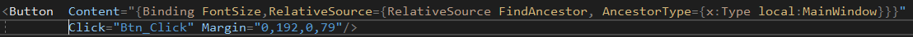
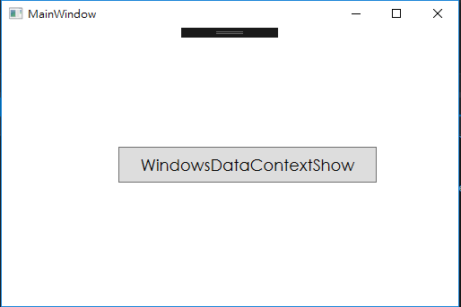

# WPF DataContext 概念釐清

## 前言
在網路上有看到一段對於 DataContext 的解說，他說 “The DataContext property is the default source of your bindings, unless you specifically declare another source, ” [WPF tutorial]。這句話是說 DataContext 屬性是綁定的預設資料來源，除非你特別的去定義其他來源，這句話是甚麼意思呢? 在不指定特定的 DataContext 或是其他資料來源的情況下， <Label x:Name = “label” Content = “{Binding Name}”/> 這段程式碼會去跟 DataContext 要Name的資料(這是在 XAML 的表達樣式)，如果是程式碼他實際上是 label.Context = label.DataContext.Name，這樣子就可以知道，所有的資料來源都會從 DataContext 去抓資料，接下來我會針對三點進行 DataContext 的概念解說與測試：

1.	UI 物件的綁定資料來源預設是 DataContext
2.	UI 物件的資料來源可以重新指定
3.	DataContext 可以被繼承

## UI 物件的綁定資料來源預設為 DataContext
首先，我們要先了解，在 WPF 中 UI 物件都是繼承 FrameworkElement，裡面具有 DataContext 的屬性，所以每個 UI物件都具備 DataContext，根據上面的資料，我們進行驗證一下，看是否資料來源是否預設都是從該 UI 物件的 DataContext 抓取想要的資料，先看一段程式碼。

我們先做綁定，但並沒有實際指定要綁定的值以及來源，先看一下如果我們這麼做的話，此 Button 的DataContext會是甚麼，如下圖所示，在 DataContext 的部分是空的，而在我們 UI 的畫面顯示上也沒有出現想要出現的訊息。

接下來，我們在前面的地方幫此 Button 加裝 DataContext，並且在執行一次看看裡面的 DataContext 是否有資料，如下圖，

可發現我們的 DataContext 已經出現 “OK12” 的資料了，而且 Button 的Context 也出現了 OK12 的字樣，表示物件的資料來源真的是從 DataContext 來的。

## UI 物件的資料來源可以重新指定
如果我們有明確指定資料來源，那麼該 UI 物件所綁定的屬性就不會再去 DataContext 裡面找資料，通常指定資料來源的方法有，ElementName、RelativeSource等，接下來我就把Button Context 屬性的資料來源綁定 Windows FontSize 屬性上面，如下圖，

可以發現，這樣綁定的話，裡面的資料來源就不是從 Button 的 DataContext 裡面去找了，而是把Windows 的FontSize 當作是資料來源，而且這樣子的綁定還是有效的。

最後是 DataContext 具備繼承的特性，在 WPF中幾乎所有的屬性都可以被繼承，也就是說，子類別如果沒有去特別的指定想要的屬性，基本上都會從父類別端去繼承該屬性，這點在 DataContext 上也是一樣的。
現在我讓外部的 Window 寫上 DataContext，然後裡面的 Button 就不指定 DataContext ，看這樣是否還是可以讓 Button 的 Content 顯示出想顯示的字體出來，如下圖

經過測試發現，Button 的 Content 真的有顯示出我們想要的字串出來，而且該字串真的是從 Window 的 DataContext 繼承而來，表示 DataContext 真的是具備繼承的特性。

`DataContext 的型別為 object 表示說，所有的資料型別都可以是放進 DataContext 裡面。`

參考文獻: http://www.wpf-tutorial.com/data-binding/using-the-datacontext/
